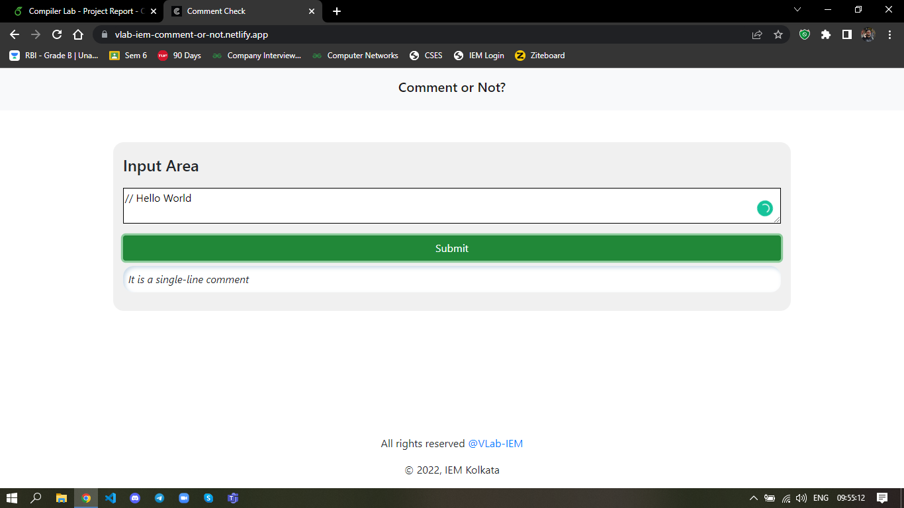
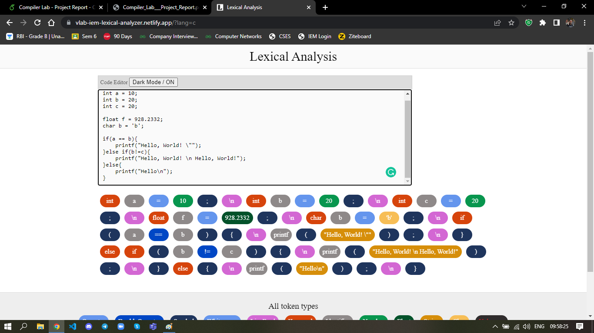
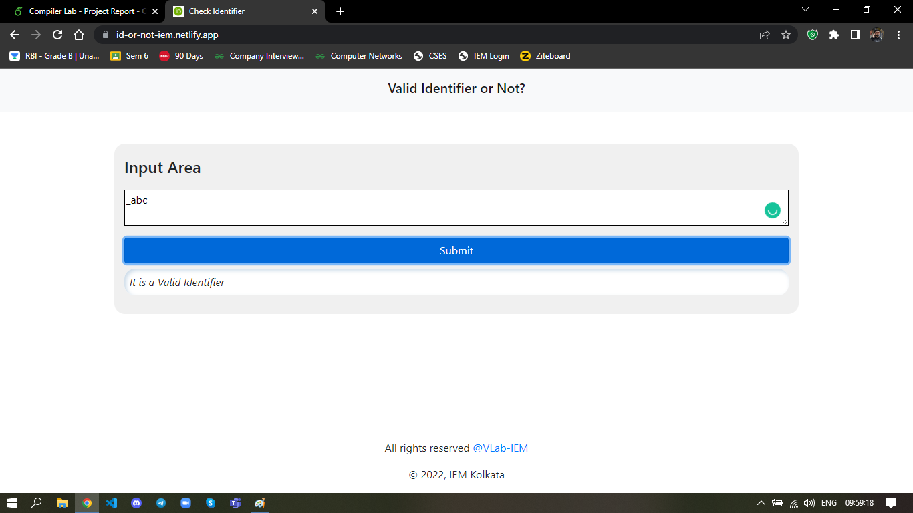

 
  

    

    ➡️ Website Link: <a href="https://vlab-iem.netlify.app/">Link</a>

 

# Introduction

Compilers translate high-level programming languages such as C and C++
into assembly code for a target processor. Used for decades to program
desktop operating systems and applications, compilers are among the most
widespread software tools. According to definition, a compiler consists
of a series of phases that sequentially analyze given forms of a
program, and synthesize new ones, beginning with the sequence of
characters constituting a source program to be compiled and ultimately
producing a relocatable object module that can be linked with others and
loaded into a machine’s memory to be executed. In the whole Compiler
Designing process, namely 4 stages are involved in the frontend (Lexical
Analysis, Syntax Analysis, Semantic Analysis, Intermediate Code
Generation) and 2 optional but recommended stages are involved in the
backend (Code Optimization, Code Generation). Early in the compilation
process the source program appears as a stream of characters. The two
subprocesses of "scanning" and "screening" constitute the process known
as lexical analysis. Scanning involves finding substrings of characters
that constitute units called textual elements ( Words, Punctuation,
Single and Multi-Character Operators etc.). Screening involves
discarding some textual elements, such as spaces and comments, and the
recognition of reserved symbols, such as the key words and operators,
used in the particular language being translated. It is the output of
this process, usually called a token stream, that is the input to the
parser. After Lexical Analysis, the syntactical structure of the given
input is checked in the Syntax Analysis Phase. Through generating a
parse tree, it checks whether the structure is valid or not. The task of
Semantic Analysis is to determine properties and check conditions that
are relevant for the well-formedness of the programs according to the
rules of programming language, but that can go beyond of Context-free
Grammars.  
The next step involves Intermediate Code Generation, which deals with
the breaking down of the input code into smaller fragments in order to
execute and handle the code more efficiently. In the last two phases in
the backend, the high-level code gets translated into low-level machine
code with some optimizations being performed to the code.

# Related Works

Previously, the concepts of Compiler Design was implemented in the field
of distributed quantum computing. To establish the network and
communication functionalities provided by the Quantum Internet through
remote quantum processing units(QPUs), designing of a proper compiler is
an inseparable task. Also in India, several attempts were taken to ease
the process of learning a difficult concept like compiler design in
various educational institutes such as Delhi University. Institutes like
IIT Bombay has also developed a Virtual Simulation Laboratory(V-Lab) to
deliver practical, real-life and hands on concepts regarding various
Compiler Design Concepts(CDC). Also, there have been major efforts in
the field of CDC regarding compiler support for distributed memory
parallel machines.

# Languages Used

  - HTML5 (For Building the skeleton of the website)

  - CSS3 and Bootstrap 4 (For stylization and beautification)

  - Javascript (For creating user-interactive panel and applying
    animations and effects)

  - C (We have included the C Codes for the users to study)

# Website Construction and Design

We have constructed our website keeping an user-friendly and virtual
education-oriented approach in mind. We have focused on five different
core CDC topics:  

  - Identifier Validation

  - Comment Checking

  - Lexical Analyzer

  - Left Right Derivation

  - Parse Tree Generator

For the ease of navigation and improved interactivity, every topic
contains five segments beside the simulation process:

  - Aim of the Lab

  - Theory behind the key concepts

  - Input/Output(I/O) Examples

  - C Code

  - Online Simulator

  - Discussion

  - Source of error and error recovery

## Comment Checking

Comments are a crucial part of a code as they act as a necessary tool
for understanding the different segments of code. It helps to describe,
analyze and keep a track of important takeaways in a code snippet. But,
for a compiler they act as a redundant part as they don’t contribute
anything to the execution of the program itself and hence should be
removed with immediate effect. This is where identifying comments become
a mandate.

In the simulation segment, the web application takes an input strings
and determines if it is a comment or not. It does so by checking the
string itself. On the basis of identification, they can broadly be
classified into two categories:

  - Single Line Comment(If the string starts with ’//’)

  - Multi Line Comment(If the String starts with ’/’ and ends with ’/’)

 - Check Valid Comment    

 - Check Invalid Comment    

## Lexical Analysis

It’s the first phase of Compiler Design which mainly deals with
classifying tokens from a given code snippet. Tokens can be considered
as the smallest logical units of a program, which are generally
identified by the longest-match rule in a lexical analyzer. In our
simulator, we filter out the tokens from a given input stream of
characters(Strings), which consists of:

  - Keywords

  - Function Names

  - Identifiers

  - String Constants

  - Special Characters

  - Operators

Besides selecting the tokens, it also eliminates the non-tokens from the
program, such as:

  - Tabs

  - Whitespaces

  - Comments

## Validating Identifiers

Identifiers are the combinations of alphanumeric characters that are
eligible for using as an user-defined name for any variable, function,
class, method etc. So, validating an identifier is an important task for
any compiler. Our simulator also checks whether a given string is a
valid identifier or not by checking some pre-defined parameters for
qualification, like:

  - Starting with an underscore()

  - Starting with any lowercase (a-z) or uppercase(A-Z) letters

  - Absence of any whitespace

  - Not having any special characters(\#,%,$ etc.) after the first
    character

  - Shorter than 31 characters, in length.

## Left Right Derivation

Context free Grammar(CFG) comes under type-2 grammar which is used to
generate all the possible combinations of a string written in a formal
language. So, CFG is beneficial in the domain of compiler design as well
as parser programs. CFGs are used to derive a parse tree which is used
to represent the semantic information of a given input string. In our
simulator, we are intended to display the leftmost and the rightmost
derivation of a given set of CFG. Derivation tree gives an overview of
how each variable is substituted in the process from the root node to
the leaf nodes. In case of leftmost and rightmost derivations, the
string is derived by expansion of the leftmost and rightmost
non-terminals respectively, at each step.

The derivation complexity function d(F) on grammar G showcases that a
constant factor n is able to boost up the derivation speed, if the
corresponding grammar G’ in (F) is found for each positive appearances
of n.

## Parse Tree Generator

In the syntax analysis phase, the generated output is nothing but a
hierarchial structure of the derived grammar which is termed as a parse
tree. Basically, parse trees are nothing but a pictorial representation
of derivations that consists of terminal and non-terminal symbols.
Understanding different parsing types such as LR(0), SLR(1), LALR(1),
CLR(1) requires deep conceptual and mathematical knowledge. So,
visualizing the parse trees in a virtual lab and simulator can be proven
as a huge leap towards simplification of the aforesaid concept. In our
simulator, we have taken one expression and generated a parse tree out
of it. After that, we have translated the tree into an abstract data
type also known as an Abstract Tree Syntax(AST).

# Conclusion

World Wide Web (WWW) has emerged as a leading platform in the recent
years for delivering a plethora of information and quality services. The
advent of Web Applications has provided us with an abundance of
convenient features like remote accessibility, cross-platform
compatibility and rapid development. In this field, JavaScript has
contributed a lot in enhancing the overall website aesthetics and
boosting up the user experience with improved user interactivity.

In the times of COVID-19 pandemic, when the whole world was behind the
closed doors of their home and offline education became unfeasible to
carry on, online education was the only way to go. JavaScript helped to
facilitate online education by developing E-academic based collaborative
learning platform with certain mathematics-based tools such as Geogebra.
Also, as a replacement of traditional laboratories, Virtual labs and
Remote labs are being developed using JavaScript for learning the
concepts virtually from any corner in the world. It also solves the
problem of supervising an entire classroom and tracking and monitoring
the progress of the students gets much easier as well. Thus, Virtual
Labs play a vital role in revolutionizing the entire educational
framework of the globe.

# Acknowledgement

First and foremost, We would like to thank **Prof. Subhabrata Sengupta**
*(Department of Information Technology, Institute of Engineering and
Management)* and **Prof. Pulak Baral** *(Department of Information
Technology, Institute of Engineering and Management)* for guiding and
motivating us through the entire timeline of the project. Without their
utmost care, advice and support, it would have been impossible to
complete this project successfully. Also, we would like to thank all of
our teachers, classmates and friends for helping and guiding in the
times of difficulty. We can’t express our gratitude to each one of them.

# Limitations

Due to unavailability of resources, input-based simulator was not
implemented in the 4.4 and
4.5 sections. Instead, a predefined
expression was taken into consideration for showing the workings of
those sections.

Some more core concepts regarding Compiler Design can also be
implemented at the later stages of development of the Web application.

# CONTRIBUTORS ✨

Thanks goes to these wonderful people

<table>
  <tr>
    <td align="center"><a href="https://github.com/rohan26062001"> <b>Rohan</b></a> </td>
    <td align="center"><a href="https://github.com/DebangshuKundu"> <b>Debangshu</b></a> </td>
    <td align="center"><a href="https://github.com/nitroidzero"> <b>Soham</b></a> </td>
    <td align="center"><a href="https://github.com/Abhirup2"> <b>Abhirup</b></a> </td>
    <td align="center"><a href="#"> <b>Mainak</b></a> </td>
  </tr>
</table>